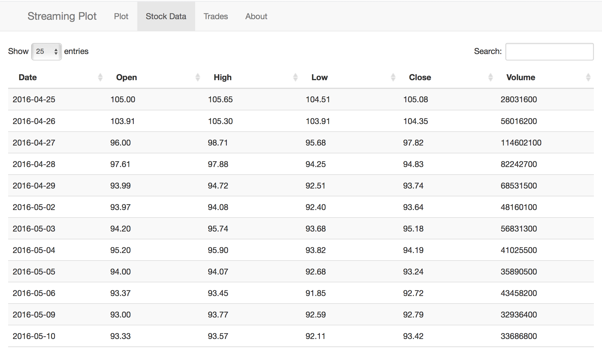
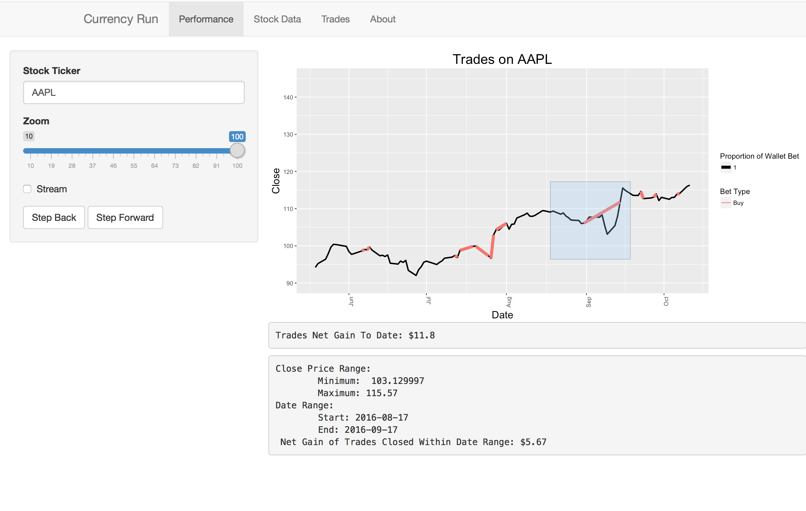
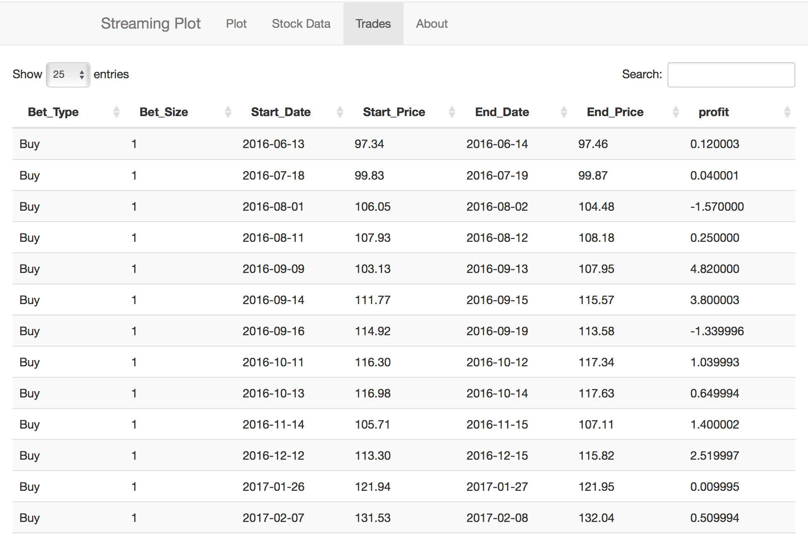

# Currency Run
### Sam Haaf (sbhaaf@dons.usfca.edu) & Nick Levitt (nplevitt@gmail.com)
### MSAN 622

# Introduction

We set out to build a clear and concise visual representation for the performance of a stock trading algorithm. Utilizing an R-Shiny interactive web application, we made calls to a Python script that builds a reinforcement learning neural network using Tensorflow, trains and trades on a user-specified stock, and then passes the raw stock data as well as the trade log back to the R-Shiny server.  

# Dataset

The dataset used for this visualization comes directly from Yahoo Finance. Given a user-specificed Stock ticker, the application downloads a years worth of Stock data from Yahoo and saves it as a csv file within the user's `/tmp/` folder. As a result, this application is designed for Linux.

A sortable and searchable data table of the raw data can be found under the `Data` tab of the app.

# Requirements

This app has a few more requirements than your classic R-Shiny app, due to the fact that it also runs a Python script in the back-end. As a result, this app can not be ran using the standard call directly from the R console. Rather, it requires cloning the repository directly so you can manually specify your Python path within the `server.R` file. This is the very first line of the file:

`PYTHON_PATH <– "<Your Filepath Here>"`.

Furthermore, it depends on a couple different Python modules, mainly `numpy`, `pandas`, `scipy`, `yahoo_finance` and `Tensorflow`. Please ensure that you have these modules installed on your machine before trying to run this app.

# Running The App

As mentioned above, this app requires cloning the repository directly so as to allow for manipulating the `PYTHON_PATH` variable found at the top of the `server.R` file. Once this has been done, the app can be ran the same way you would run any other R-Shiny application.

It should be noted that the speed of this app is directly dependent on the speed of your internet. With every change of the stock ticker, the application downloads the data from Yahoo Finance, and a slow internet connection will cause the app to appear slow itself. 

# Understanding The App

This dashboard was developed to visualize the behavior of an automated trading strategy on real stock data. It serves as the front end to a python script which collects the data, simulates trades on the data and then serves the results back to R for visualization.

The plot you will is streaming through the data and plotting red and green lines for the long and short trades, respectively. The thicker the line, the more of your wallet the agent bet on the trade. Ideally you want to see many or thick green lines with a positive slope, and many or thick red lines with a negative slope.

You can view the data about the trades directly in the Trades tab. There you will find the starting and ending prices, the stake wagered on the trade, and the return you made per dollar in your virtual wallet.

This program is ideal for visualizing the behavior of a reinforcement learning agorithm that interacts with a stock market simulator. There are included a simple stock market simulator that returns a reward proportional to the gain in wallet, as well as a simple deep reinforcement learning algorithm. The code to train the algorithm is not included, and the neural network being implemented is not trained. There will be a trained model added soon that behaves more realistic behavior, but until then a new model will be initialized on every call.
